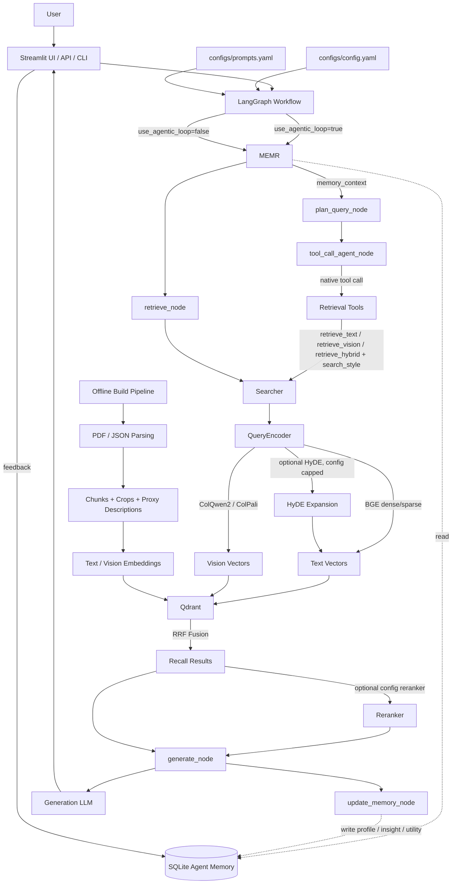

# Omni-Modal Agentic RAG Architecture

This project has two main paths: an offline indexing pipeline that builds the Qdrant collection, and an online RAG workflow that retrieves memory, plans, retrieves evidence, generates answers, and writes reusable agent experience.




## Agent Memory System

The memory system is not an independent agent. It is a rule-based experience library with optional LLM reflection.

It records each run as reusable strategy experience:

- `profile`: what type of task/question this run represented.
- `insight`: what planning, modality routing, tool selection, or `search_style` behavior worked or failed.
- `utility`: how a future agent should use this experience.
- `reward`: heuristic or explicit feedback score.
- `plan_json`, `tool_trace_json`, and `answer_summary` for traceability.

Memory is injected before retrieval planning:

- `retrieve_memory_node` reads similar high-reward experiences from SQLite.
- `memory_context` is passed into `plan_query_node` and `tool_call_agent_node`.
- The planner may use it to improve step decomposition and modality routing.
- The tool-calling agent may use it to improve tool selection and `search_style`.

Memory is written after answer generation:

- `update_memory_node` summarizes the run into `profile / insight / utility`.
- If `agent_memory.use_llm_reflection` is enabled, the LLM writes the reflection.
- If LLM reflection fails or is disabled, deterministic fallback reflection is used.

Memory is not factual evidence. Final answers must still be grounded in the current retrieved documents.

## Memory Update Behavior

When a new run finishes, memory performs a simplified HERA-style update:

- `ADD`: no similar memory exists, so a new experience is inserted.
- `MERGE`: a similar memory exists and the new experience is useful, so profile/insight/utility/tags/reward are merged.
- `KEEP`: a similar existing memory has clearly better reward, so the existing memory is kept and usage count is updated.
- `PRUNE`: a poor duplicate experience is not inserted.

Explicit feedback overrides heuristic reward:

- Helpful feedback sets reward to `1.0`.
- Not helpful feedback sets reward to `-1.0`.
- Only memories above `agent_memory.min_reward_to_reuse` are injected into future prompts.

## Retrieval Control

The agent chooses a modality-level tool and an intent-level retrieval style:

- `retrieve_text`, `retrieve_vision`, `retrieve_hybrid`
- `search_style`: `auto`, `exact`, `semantic`, or `expanded`

The agent does not directly control backend switches such as `use_dense`, `use_sparse`, `use_hyde`, or `use_reranker`. Those remain capped by `configs/config.yaml`.

## Search Style Mapping

- `auto`: use the configured dense, sparse, HyDE, vision, and reranker settings.
- `exact`: disable HyDE and prefer sparse lexical matching; fall back to dense only if sparse is disabled.
- `semantic`: disable HyDE and use configured text semantic/lexical routes.
- `expanded`: allow HyDE only when `use_hyde` is enabled; otherwise degrade to semantic behavior.

All active recall routes are fused through Qdrant RRF before optional reranking.

## Memory Configuration

The first version uses local SQLite storage:

```yaml
online:
  agent_memory:
    enabled: true
    storage_path: "./data/memory/agent_memory.sqlite3"
    retrieve_top_k: 3
    min_reward_to_reuse: 0.3
    write_after_chat: true
    use_llm_reflection: true
    max_experiences: 1000
```

The API returns `memory_id` for each chat response and supports feedback through:

```http
POST /v1/memory/feedback
```
