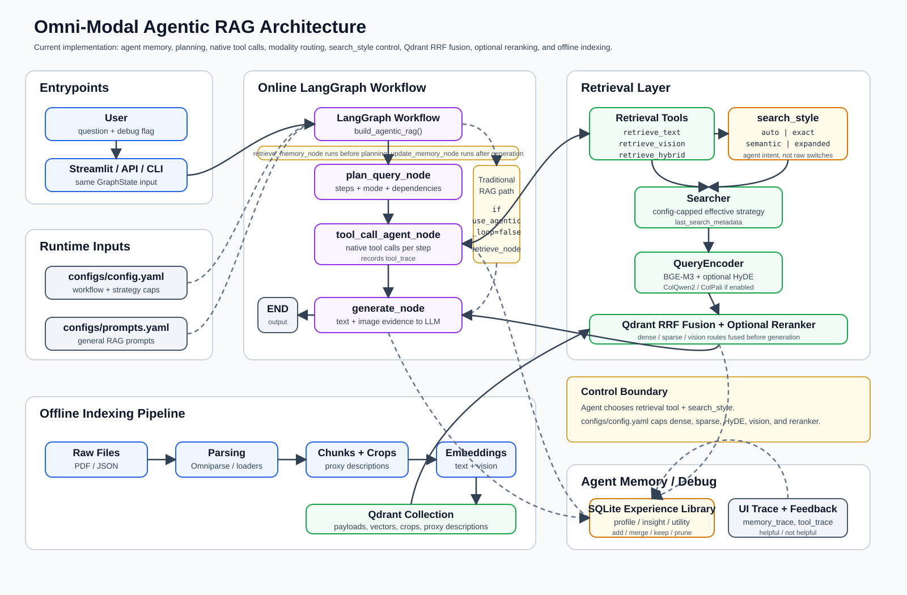
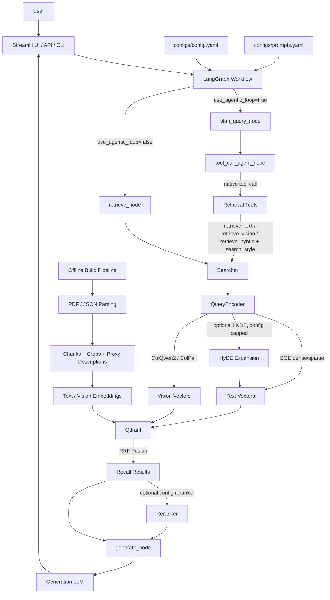

# Omni-Modal Agentic RAG Architecture

This project has two main paths: an offline indexing pipeline that builds the Qdrant collection, and an online RAG workflow that plans, retrieves, and generates answers.

## Retrieval Control

The agent chooses a modality-level tool and an intent-level retrieval style:

- `retrieve_text`, `retrieve_vision`, `retrieve_hybrid`
- `search_style`: `auto`, `exact`, `semantic`, or `expanded`

The agent does not directly control backend switches such as `use_dense`, `use_sparse`, `use_hyde`, or `use_reranker`. Those remain capped by `configs/config.yaml`.

## Search Style Mapping

- `auto`: use the configured dense, sparse, HyDE, vision, and reranker settings.
- `exact`: disable HyDE and prefer sparse lexical matching; fall back to dense only if sparse is disabled.
- `semantic`: disable HyDE and use configured text semantic/lexical routes.
- `expanded`: allow HyDE only when `use_hyde` is enabled; otherwise degrade to semantic behavior.

All active recall routes are fused through Qdrant RRF before optional reranking.
